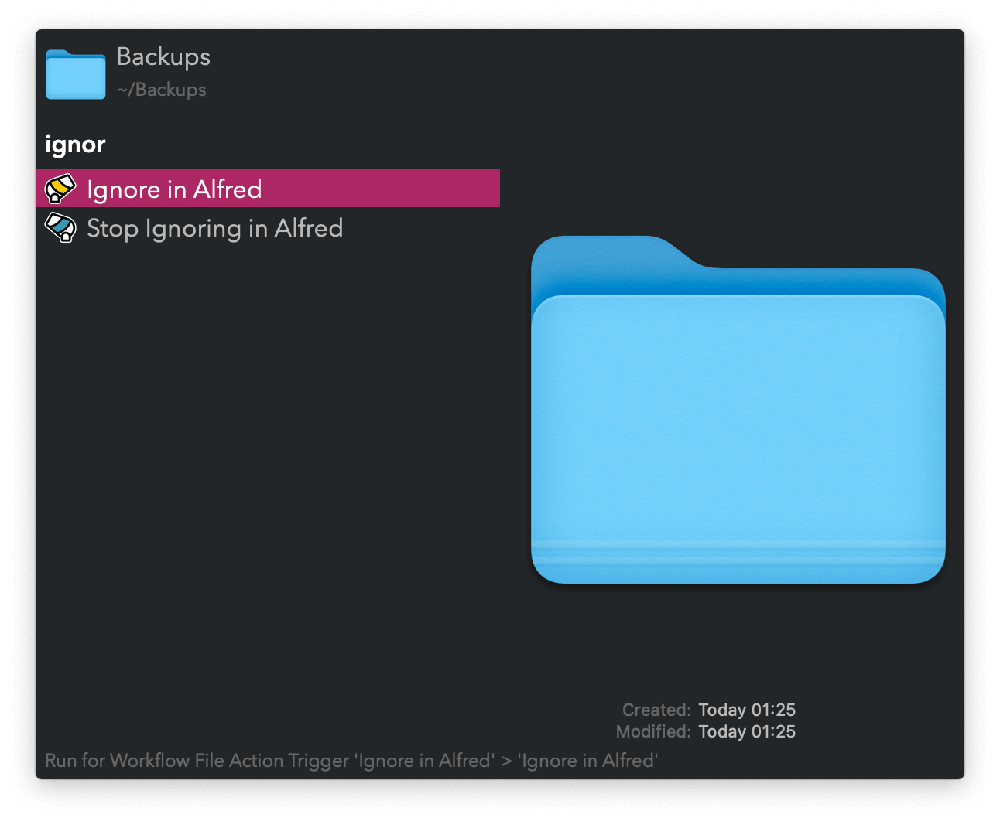

#  Ignore in Alfred Alfred Workflow

Exclude files and folders from Alfred’s search results

<a href='https://github.com/alfredapp/ignore-in-alfred-workflow/releases/latest/download/Ignore.in.Alfred.alfredworkflow'>⤓ Download Workflow</a>

## Usage

Use the [Universal Actions](https://www.alfredapp.com/help/features/universal-actions/) to remove or readd files and folders from Alfred’s search results.

Alteratively, run the Keywords (defaults: `ignore`, `unignore`, and `reignore`) and type to filter.

